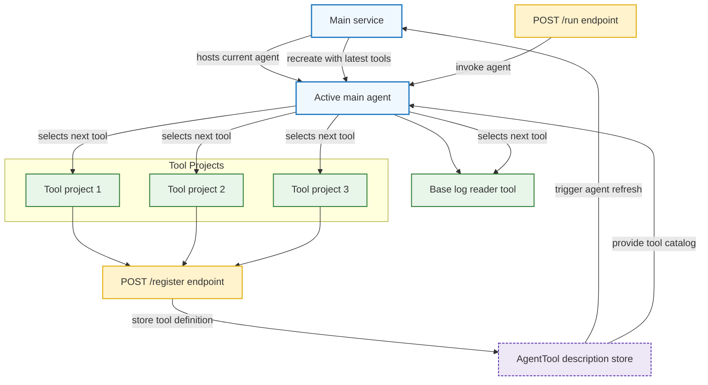

# Agent Orchestration Design

## Architecture Overview

In main starts an agent. We give it a base tool to read logs form our system (mocked from text files).

Main has an endpoint, `/register`, that enable agents or functions to register (currently only tool support).

Main also hs the endpoint `/run` that allows us to prompt it.

Tools are spread out over different projects, using the register enpoint to register themself on startup. In the payload there is a description `AgentTool` object describing the tool to be registered - hopefully giving the agent enough information to sucessfully choose the right tools, in the right order, when we ask it to perfomr our task.

This also means that choosing the next tool in the right order is up to the Agent/Model. So in essence the planning phase is up to the Agent, not the user. And no specific agent tool is implemented that relies on any other tool.

### Architecture Diagram

## Orchestration Flow and Communication Strategy

## Scaling, Reliability, and Future Extensions

- **Extensibility** Since the project does not actually implements the requirements of the original specification, with some tools directly relying on others, this could be implemented. The proposed way is to introduce a "DependsOn" property in the AgentTool definition.
Question is how that then should be implemented in the best way? Since we know that just asking a model to do things in a specific way does not make it fully dependable, a workflow setup is recomended. Where tools are converted to Agents and that a workflow is setup between these agents when they register.

- **Scaling**: There are multiple ways to scale LLM based systems, but first we need to find out what models we decide to use, and where in the solution. Model inference is often the most time consuming thing in an Agent based solution, and how to solve the bottle necks is a per solution/architecture basis descicion.

- **Reliability**: As per the instructions, this is not in any way or form production ready code. Evals for agents/models, tracing, error handling and unit tests are needed.

- **Extensibility to real AI models**: We could introduce more agents in the tools, but when creating agent based systems, there is a fine line between when "classical" code is prefered over anything LLM based. In this solution we definately could use more LLM for actually making a verifying pass over redacted logs, and for the report generator.
